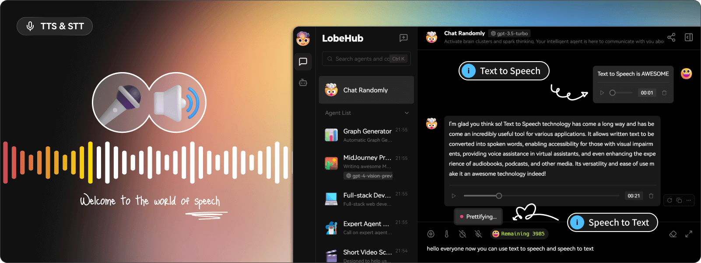

# Lobe Chat CI/CD pipeline

Deploy Lobe Chat server with CI/CD on Elestio

 
 

# Initial Configuration

For self-hosted instances of Lobe Chat, OpenAI API key integration is essential.

Follow these steps to set up your environment variables:

1. Navigate to the Elestio dashboard.

2. Access the "Service overview" and click on the "UPDATE CONFIG" button.

3. Open the "Env" tab to update your environment variables indicating your credentials.

4. Copy your OpenAI API key and paste it into the "OPENAI_API_KEY" variable.

5. Click on "Update & Restart" to apply the changes.

This ensures that your self-hosted Lobe Chat instance is properly configured with the required OpenAI API key.

# Once deployed ...

You can open Lobe Chat here:

    https://[CI_CD_DOMAIN]/
    password: [ADMIN_PASSWORD]
